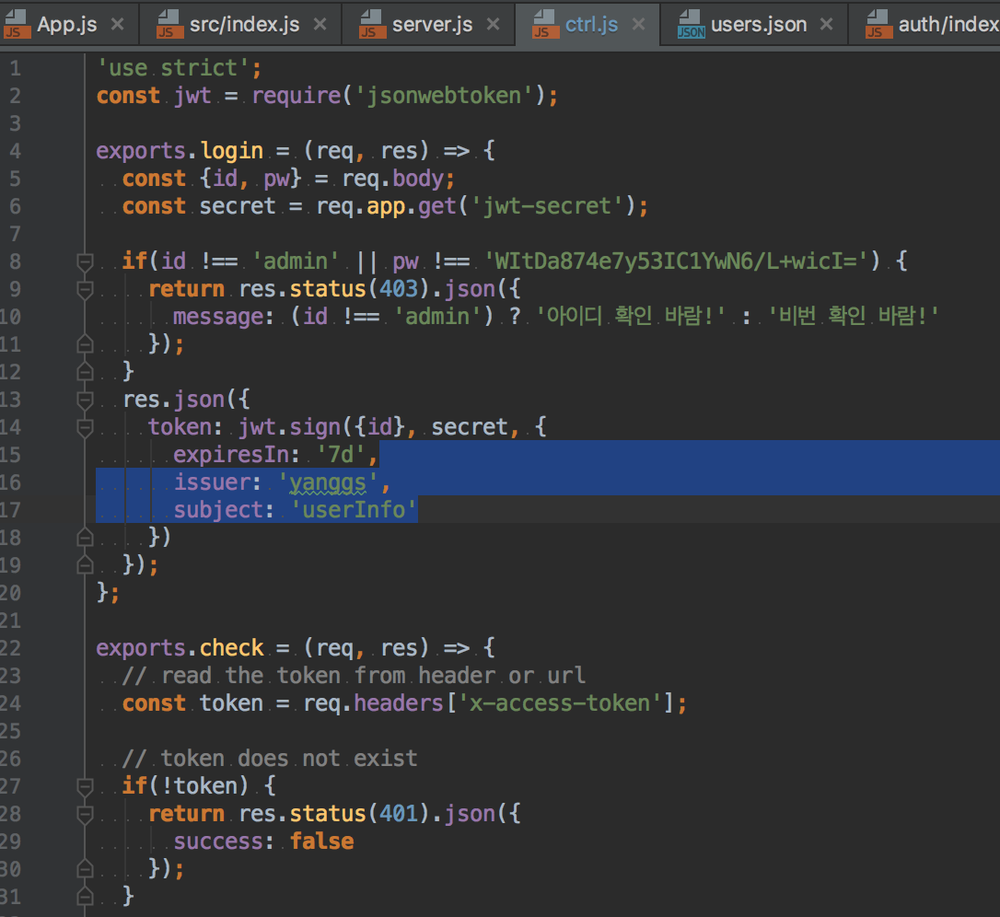

# perf-chk (Performance Check)
[](https://www.npmjs.com/package/perf-chk)


## Why did you make perf-chk?
I'm interested in code execution time,  
So I sometimes test my code,  
then I use below code.  
```javascript
const iterations = 10000000;
console.time("function A");
for(let i=0; i<iterations; i++){
  // some code1
}
console.timeEnd("function A"); // 'Function A: xxx.xxx ms'
console.time("function B");
for(let i=0; i<iterations; i++){
  // some code2
}
console.timeEnd("function B"); // 'Function B: xxx.xxx ms'
```
but I can't remember upper code.  
So I copy & paste upper code,  
and edit many code(function name, code, iteration count).  
It is very annoying...
so I made perf-chk!

## What is perf-chk?
It is execution time checker in Node.js.  
Use perf-chk if you want to know which code is faster.  

## Getting Started
### Installation
* global (recommended)
```bash
npm i -g perf-chk
```
* local  
```bash
npm i -D perf-chk
```

### Usage
#### 1. make your test code. (module)  
```javascript
// some code
// blahblah

module.exports = {
  methodA: function() { // ES5 function syntax
    // blahblah
  },
  methodB() { // ES6 Method syntax
    // blahblah
  },
  methodC: () => { // ES6 Arrow Function syntax
    // blahblah
  }
}
```
##### note
* module.exports = {} is module export syntax in node.js.  
  and perf-chk is node.js app, so you must use this syntax.  
* You can choose function syntax  

#### 2. check execution time
1. open terminal(cmd in windows)  
2. type below,  
```bash
perf-chk {module_name} [iteration_counts]
```
If you installed it locally, type below  
```bash
./node_modules/perf-chk {module_name} [iteration_counts]
```
  

##### note
module_name is required, and module_name is \<filename>.js or \<filename>  
iteration_counts is optional, default value is 100,000,000.  
if the execution time of functions are similar,  
There is no difference between them,  
but you want to know diffrence of execution time,  
you have to extend iteration_counts

## Notes
Execution time isn't same.  
It depends on Computer specification(CPU, RAM, etc.)  
And same computer's result isn't same.  
Because CPU and RAM usage is Vary every time.  
So use execution time for reference only.